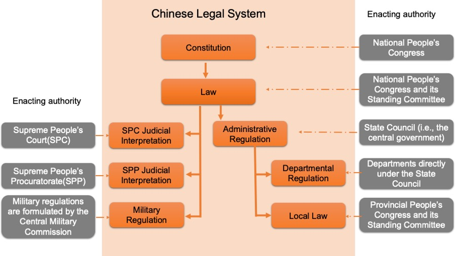

# Complement document

## Continental law system

### The continental and civil law legal systems

The **Continental and Civil Law Legal Systems** can be truly considered to be the most prominent legal systems in the world which laid a foundation for legislation in many countries. Although, nowadays it can be quite difficult to find a distinguished boundary between Continental and Common Law Legal Systems (as they have adopted each other’s practices to a large extent), the legal scholars point out the list of criteria which might be employed to differentiate between those two legal systems. For instance, some scholars proposed “culture” or “language” to be used for classification. Others insisted that it must be ideology which stipulates peculiarities of Continental and Common Law Legal Systems. However, most of the scholars do agree that historical background and types of the sources used are the most objective criteria.

The Continental Law Legal System takes its origin in Roman Law in times when it was first codified by Roman emperor Justinian. Justinian’s efforts resulted in compilation called Corpus Juris Civilis. The fact that Corpus Juris Civilis was a main object for study in the Italian universities of Renaissance period enabled the Roman Law to spread over the rest of Europe and greatly influence European legal systems. The result of such influence was a continued tradition of codification during the age of enlightenment (in XVIII century) when separate national codes such as The French Napoleonic Code, German and Swiss codes were developed.

The Continental Law Legal System has been formed under the influence of legal scholars whose legal doctrines became a basis for codes. *Therefore, it is commonly accepted that civil law was developed in the universities rather than in courts.* In other words, the written rules such as legislative statutes have been the main source of law in civil law countries. It is precisely this fact that explains a diminished judge’s role in Continental Law Legal System. Since a civil judge has to apply already existing codes for resolving cases instead of expressing his judicial opinions there is much less importance attached to a civil judge’s merit in contrast to his common counterpart.

Common or English Legal System was first developed in England and Wales. It was later adopted by many countries throughout the world as a result of British colonisation. Australia, South East Asia, India and Hong Kong are the countries with “received” common tradition. The Common Law Legal System has been developed out of unwritten rules and customs. In common countries the cases are resolved by “judge-made decisions” which follow the principle of stare decisis, i.e. “to decide similar cases similarly”. This fact explains the importance of case law as a primary source of English Legal System.

> The principle of **stare decisis** is a fundamental doctrine in common law legal systems that obligates courts to follow the precedents set by previous judicial decisions when the same points arise again in litigation. The term "stare decisis" is Latin for "to stand by things decided." This principle ensures legal consistency, predictability, and stability by maintaining that similar cases are decided in similar ways.
>
> **Key Components of Stare Decisis:**
>
> 1. **Adherence to Precedent:**
>    - Courts are expected to follow the legal principles established in prior decisions, especially those from higher courts within the same jurisdiction.
>    - This adherence applies primarily to the *ratio decidendi*, the legal reasoning or principle upon which a case's decision is based.
>
> 2. **Hierarchy of Courts:**
>    - Lower courts are bound by the decisions of higher appellate courts.
>    - Decisions from courts of equal standing or from other jurisdictions may be considered persuasive but are not binding.
>
> 3. **Binding vs. Persuasive Precedent:**
>    - **Binding Precedent:** Must be followed. It comes from higher courts in the same jurisdiction.
>    - **Persuasive Precedent:** May influence a decision but is not obligatory. It can come from lower courts, courts of equal status, or courts in other jurisdictions.
>
> 4. **Exceptions and Overruling:**
>    - A court may depart from precedent if it deems the previous decision was wrong or societal conditions have changed.
>    - Higher courts have the authority to overrule decisions from lower courts or their own past decisions.
>
> **Advantages of Stare Decisis:**
>
> - **Legal Certainty:** Individuals and businesses can predict legal outcomes, which aids in planning and risk assessment.
> - **Equality and Fairness:** Similar cases are treated alike, promoting a sense of justice and impartiality.
> - **Efficiency:** Courts save time by relying on established legal principles rather than re-evaluating settled law in every case.
>
> **Limitations of Stare Decisis:**
>
> - **Rigidity:** Strict adherence may perpetuate outdated or unjust rulings.
> - **Judicial Discretion:** Judges may interpret precedents differently, leading to inconsistent applications.
> - **Evolving Societal Values:** Law may lag behind societal changes if courts are reluctant to overturn precedents.
>
> **Examples:**
>
> - **Brown v. Board of Education (1954, U.S.):** The U.S. Supreme Court overturned the "separate but equal" doctrine established in Plessy v. Ferguson (1896), showing that stare decisis allows for correction of past errors.
> - **Donoghue v. Stevenson (1932, UK):** Established the modern concept of negligence, setting a precedent for duty of care that courts have followed in subsequent cases.
>
> **Application in Legal Systems:**
>
> - **Common Law Jurisdictions:** Countries like the United States, the United Kingdom, Canada, and Australia heavily rely on stare decisis.
> - **Civil Law Jurisdictions:** Less emphasis on precedent; courts focus more on statutory codes and less on judicial decisions.
>
> **Conclusion:**
>
> Stare decisis plays a crucial role in maintaining a coherent and stable legal system by ensuring that courts follow established legal principles. While it promotes consistency and reliability, the doctrine is flexible enough to allow the law to adapt over time through judicial review and the overruling of outdated precedents.

#### Procedural and substantive law

Procedural and Substantive Law are two branches of law which can not function independently from each other.

Substantive Law can be described as a body of rules which sets out the rights and obligations of members of society. On the other hand, Procedural Law encompasses legal rules to enforce and defend such rights and obligations. For instance, it is a substantive law that defines murder as a criminal offence. Meanwhile, the Procedural Law describes the way the arrests have to be made, witnesses are questioned and evidences are collected.

### Civil Law and Civil Procedure versus Criminal Law and Criminal Procedure

Civil Law is a form of private law and involves the relationships between individual citizens The Civil law attempts to resolve disagreements between individuals or organizations and to provide remedies. It should be emphasized that unlike criminal law, the civil law does not intend to punish the offender. Contract disputes, property disputes, divorce cases, child custody and other private matters are the issues regulated by Civil Law.

Criminal law is a branch of law which concerns crimes committed against the public authority. In contrast to Civil law where the remedy typically takes the form of compensation or fine, the offender in criminal proceeding can be punished by imprisonment, government supervision, loss of liberty, fine and even execution.

The civil and criminal procedures are different in terms of claimants bringing the case into court and parties involved in the trial process. Civil proceeding is initiated by the plaintiff represented either by an individual or an organization which strives to obtain a financial compensation for incurred damages. By contrast, any criminal proceeding is enforced by the state through the prosecutor. This happens because any crime against an individual is considered to be an offence to the society.

The prosecutor prepares evidences and charges against the accused criminal. Therefore, the burden of proof lies solely upon the prosecutor, which means that the prosecutor is responsible for providing evidences against the defendant. On the other side, the plaintiff is the only person to have the burden of proof in civil cases. Whereas *it is enough for plaintiff in civil procedure to persuade that the wrongdoing was likely to take place rather than not*, the prosecutor has an obligation to prove that the crime was committed *without any doubts*. In other words, the standard of proof in civil and criminal procedures is different: civil cases must be proven on the balance of probabilities and criminal cases – beyond a reasonable doubt.

In fact, the offence might be criminal and civil violation at the same time. For example, in case of car accident when there is an injured person, the driver is subject to criminal as well as civil procedure.

### Civil procedure in Common and Continental Legal Systems

The significant differences in civil procedure of Common and Continental Legal Systems are stipulated mainly by the adherence either to the so-called “inquisitorial” or “adversarial” systems. Despite the fact that there have been a lot of borrowings recently in both systems, “inquisitorial” tradition is broadly defined as a prerogative of Continental Law trials, whereas Common Law trials follow “adversarial” system.

One of the factors which explain the substantial differences in civil procedures of Common and Continental Legal Systems is a judge’s role. In civil procedure governed by continental tradition the judge examines the evidences, questions the witnesses and prepares report, i.e. controls all aspects of the trial. Meanwhile, the role of judge in common civil procedure is that of a passive observer listening to the arguments and evidences presented both by a plaintiff and a defendant. Therefore, a Continental Law judge bears more responsibility for the trial rather than his Common Law counterpart.

Another point of divergence in civil procedure of Common and Continental Legal Systems is the stages of jurisdiction. In continental civil procedure these stages can be defined as preliminary stage, evidence-taking stage and decision making stage. As it can be noticed, the continental civil procedure never includes the trial stage which is sometimes a part of civil procedure in Common Legal System. This can be explained by the fact that in Common Legal System the trial is believed to be a final stage which necessarily includes a jury. Therefore, under such definition the trial does not exist in continental civil procedure. Instead of the trial the continental civil procedure consists of “a series of isolated meetings and written communications between counsel and the judge.”

The next important difference concerns an evidence-taking stage. As a matter of fact, the common lawyer is obliged to formulate the whole case at the very beginning which is an unusual practice for civil lawyers who prepares only some pieces of evidence for the first appearance before the court. Consequently, the degree of importance assigned to discovery process is much less in continental civil procedure rather than in common.

Although in continental civil procedure the judge is directly involved in the evidence-taking part of the proceeding, the case should be resolved by other judges. In contrast, the examination of evidences and the resolution of civil case are direct obligations of a single judge in common law tradition.

In continental civil law systems, while the judge is actively involved in the evidence-taking phase of the proceedings, the final resolution of the case is often entrusted to other judges who were not part of that initial phase. This separation is designed to enhance impartiality and fairness in the judicial process. Here's what it means:

> **Separation of Roles in the Judicial Process**
>
> 1. **Evidence-Taking Judge (Investigating Judge):**
>    - **Active Involvement in Evidence Gathering:** This judge conducts the investigation by collecting documents, interviewing witnesses, and overseeing the compilation of all relevant evidence.
>    - **Procedural Oversight:** They manage pre-trial procedures, address preliminary issues, and ensure that the evidence is gathered according to legal standards.
>    - **Neutral Facilitator:** Their role is to impartially collect all pertinent information without making judgments about the outcome.
>
> 2. **Deciding Judge(s):**
>    - **Reviewing the Collected Evidence:** The deciding judge or panel reviews the evidence compiled during the investigation phase.
>    - **Conducting the Trial:** They preside over the trial proceedings, hear legal arguments from both parties, and may allow for additional evidence or witness testimonies if necessary.
>    - **Rendering Judgment:** Based on the reviewed evidence and applicable law, they make a final decision on the case.
>
> **Reasons for the Separation**
>
> - **Impartiality and Objectivity:**
>   - **Avoiding Bias:** Judges who have been involved in gathering evidence might develop preconceived notions about the case. By having different judges decide the case, the system aims to prevent any potential bias.
>   - **Fresh Evaluation:** Deciding judges approach the case without prior involvement, allowing for an unbiased assessment of the evidence and arguments.
>
> - **Specialization of Judicial Functions:**
>   - **Efficiency:** Judges can specialize in procedural management or adjudication, enhancing the efficiency and expertise in each phase.
>   - **Complex Cases Management:** In cases with extensive or complex evidence, specialized judges can more effectively handle the intricacies of evidence collection.
>
> **Examples in Civil Law Systems**
>
> 1. **France:**
>    - **Juge de la Mise en État (Pre-Trial Judge):**
>      - Handles pre-trial matters, including evidence gathering and procedural issues.
>      - Does not participate in the final decision unless the case is straightforward and the parties agree.
>    - **Trial Judges:**
>      - A different judge or panel conducts the trial and renders the judgment based on the compiled evidence.
>
> 2. **Germany:**
>    - **Single Judge Proceedings:**
>      - In lower courts, a single judge may handle all aspects, but in higher courts or complex cases, roles may be divided.
>    - **Chambers with Multiple Judges:**
>      - A rapporteur judge may be responsible for preparing the case, but the final decision is made collectively by the chamber judges.
>
> 3. **Italy:**
>    - **Giudice Istruttore (Instructing Judge):**
>      - Oversees the preparatory phase, manages evidence collection, and addresses procedural matters.
>    - **Deciding Judge(s):**
>      - Another judge or panel takes over for the trial phase to decide the case based on the instruction judge's dossier.
>
> **Implications for the Judicial Process**
>
> - **Enhanced Fairness:**
>   - **Defendant's Rights Protection:** Ensures that the defendant receives a fair trial by judges who have not formed opinions during the evidence collection.
>   - **Balanced Evaluation:** Both parties can present their arguments to judges who assess the case solely on the merits presented during the trial.
>
> - **Procedural Safeguards:**
>   - **Transparency:** Clear separation of duties makes the process more transparent and understandable for the parties involved.
>   - **Checks and Balances:** The system provides internal checks by having multiple judges involved at different stages.
>
> **Contrast with Common Law Systems**
>
> - **Unified Judicial Role:**
>   - In common law jurisdictions, the same judge (or jury) typically oversees the entire process, from evidence presentation to final judgment.
>   - **Adversarial Nature:** The parties are responsible for presenting evidence, and the judge acts as an impartial referee rather than an active investigator.
>
> **Benefits of the Separation**
>
> - **Objective Decision-Making:**
>   - Judges deciding the case do so without any prior involvement, ensuring decisions are based solely on the evidence and arguments presented during the trial phase.
>
> - **Efficiency and Expertise:**
>   - Allows for procedural efficiency by assigning evidence collection to judges specialized in that area.
>   - Deciding judges can focus on legal analysis and application of the law without the procedural burdens of evidence gathering.
>
> **Potential Challenges**
>
> - **Communication Gaps:**
>   - Ensuring that the deciding judges fully understand the context and nuances of the evidence collected by another judge may require careful management.
>
> - **Extended Timelines:**
>   - Transferring cases between judges can introduce additional steps, potentially affecting the speed of proceedings.
>
> **Conclusion**
>
> In continental civil law systems, the practice of having judges other than those involved in evidence-taking resolve the case is a structural approach to uphold judicial impartiality and fairness. By separating the investigative and adjudicative functions, the system seeks to prevent biases that could arise from a judge's involvement in evidence gathering. This ensures that the final decision is made by judges who evaluate the case objectively, based on the evidence and legal arguments presented during the trial phase. This method reflects the civil law tradition's emphasis on a fair and just legal process, balancing thorough investigation with impartial adjudication.

The continental and common civil procedure uses written and oral arguments respectively. For example, during the witness testimony in common civil procedure the questions are asked orally by the advocates of both parties, whereas it is compulsory for the continental advocate to propose a question in written form to judge who can either accept or reject it. This example illustrates not only the difference in common and continental civil procedure in terms of oral or written arguments but also in the presence of cross-examination. In other words, cross-examination does not take place in continental civil procedure.

Civil procedures in Common and Continental Legal Systems differ in terms of parties who incur counsel fees. In the former case, except for England, counsel fees must be paid by each party regardless of the case’s outcome. On the other hand, in civil law countries, the loser covers the winner’s counsel fees.

A civil case trial in a civil law system is distinct from that in common law jurisdictions due to differences in legal traditions and procedural approaches. Civil law systems are prevalent in continental Europe, Latin America, parts of Africa, and Asia. They are based on codified statutes and legal codes rather than case law precedents.

> Here is an overview of how a civil case trial typically unfolds in a civil law system:
>
> 1. **Initiation of the Lawsuit:**
>    - **Filing the Complaint:** The plaintiff submits a written complaint to the court, outlining the facts and legal basis for the claim.
>    - **Service of Process:** The court serves the complaint to the defendant, who is then required to respond within a specified time frame.
>
> 2. **Written Pleadings:**
>    - **Exchange of Documents:** Both parties exchange written submissions, including the complaint, defense, counterclaims, and replies.
>    - **Emphasis on Documentation:** The initial stages focus heavily on written evidence and legal arguments submitted to the court.
>
> 3. **Role of the Judge:**
>    - **Active Judicial Role:** The judge plays an inquisitorial role, actively managing the proceedings and investigating the facts.
>    - **Case Management:** The judge identifies the legal and factual issues, orders the production of evidence, and may even question witnesses directly.
>    - **Neutral Fact-Finder:** Unlike in common law systems, the judge seeks to uncover the truth rather than merely adjudicate between opposing parties.
>
> 4. **Evidence Gathering:**
>    - **Limited Discovery Process:** Pre-trial discovery is less extensive, with the court controlling the evidence-gathering process.
>    - **Court-Appointed Experts:** Experts may be appointed by the court to provide impartial opinions on technical matters.
>    - **Written Evidence:** There is a greater reliance on documents and written expert reports over oral testimony.
>
> 5. **Hearings and Oral Proceedings:**
>    - **Structured Hearings:** Hearings are often more formal and shorter, focusing on clarifying points from the written submissions.
>    - **Judge-Led Questioning:** The judge conducts the questioning of parties and witnesses, with limited cross-examination by lawyers.
>    - **Minimal Witness Testimony:** Oral testimonies are less emphasized, and witness statements may be submitted in writing.
>
> 6. **Legal Representation:**
>    - **Advisory Role of Lawyers:** Attorneys assist in preparing written submissions and may present legal arguments but have a less adversarial role during hearings.
>    - **Collaboration Over Confrontation:** The process encourages cooperation to establish the facts rather than adversarial contention.
>
> 7. **Decision and Judgment:**
>    - **Written Judgment:** The judge issues a detailed written decision, explaining the legal reasoning and application of the law.
>    - **No Jury System:** Civil cases are decided by judges without the involvement of a jury.
>
> 8. **Appeals Process:**
>    - **Right to Appeal:** Parties can appeal the decision to a higher court, which may review both factual and legal aspects.
>    - **De Novo Review:** Appellate courts may re-examine the case entirely, not just the legal interpretations.
>
> 9. **Costs and Fees:**
>    - **Loser Pays Principle:** The losing party is often required to pay the legal costs of the winning party, including court fees and attorney fees.
>
> **Key Characteristics of Civil Law Trials:**
>
> - **Codified Laws:** Legal codes provide a comprehensive set of rules that judges apply to cases.
> - **Inquisitorial System:** The judge actively investigates the facts, reducing the burden on the parties to present evidence.
> - **Reduced Precedent Reliance:** Past judicial decisions have persuasive value but are not binding precedents as in common law systems.
> - **Efficiency and Predictability:** The structured process aims for a swift resolution, with clear procedural rules reducing uncertainty.
>
> **Examples by Country:**
>
> - **France:** The French civil procedure emphasizes written submissions, with judges playing a central role in gathering and assessing evidence.
> - **Germany:** German courts focus on written documents and have a procedural code that guides the judge's active involvement.
> - **Japan:** While influenced by both civil and common law traditions, Japan's civil procedure aligns more with the civil law model, emphasizing judge-led proceedings.
>
> **Conclusion:**
>
> A civil case trial in a civil law system is characterized by an active judicial role, a focus on written evidence, and a less adversarial atmosphere. The judge directs the proceedings to uncover the truth, applying codified laws to reach a decision. This approach aims to enhance efficiency, reduce litigation costs, and provide a predictable legal environment.

### Criminal procedure in Common and Continental Legal Systems

A lot of differences in civil procedure of Common and Continental Legal Systems discussed above can be applied to criminal procedure as well. The explanation beyond this is what tradition, adversarial or inquisitorial, the Legal System follows. For example, the role of impartial referee assigned to the judge in common civil procedure is the same for judge in common criminal procedure. Alternatively, in both continental civil and criminal cases the judge acts as an inquisitor. Moreover, the witness testimony in criminal procedure of both legal systems follows the same pattern as in civil procedure. However, there are some distinctive differences which uniquely determine criminal procedure in Common and Continental Legal Systems.

First of all, the criminal case in Common Legal System is initiated by the wronged person, his relatives or any other member of the society. A presiding officer is appointed then to hear and decide the case. By contrast, the private accuser in continental criminal procedure is replaced by public official, who represents the State’s interests. In other words, the contest has shifted from two individuals to an individual and the State.

Secondly, the difference can be found in examining phase of criminal proceeding. At this stage the evidences are collected followed by compilation of the dossier. While it is allowed to disclose the dossier to the defense in continental criminal proceeding it is prohibited in common legal proceeding.

Thirdly, in common criminal procedure the defendant must be sworn and can not refuse to answer while being questioned. On the contrary, this practice is not applied to criminal justice system in continental countries where the case is exactly the opposite.

Another important difference in criminal procedure of Common and Continental Legal Systems is plea bargaining. In contrast to common criminal procedure where plea bargaining is a distinctive feature, the prosecutor power is limited in continental countries. Moreover, in common countries “the defendant who pleads guilty forgoes a trial”. In civil countries, however, the plea guilty is not a hard evidence for defendant’s guilt. Therefore, the trial necessary takes place.

Finally, it is wrongly believed that there are no concepts of jury trial and presumption of innocence in civil criminal proceedings. In fact, “a legal presumption of innocence does exist in many civil law jurisdictions”, although in some civil countries it may not exist as a formal rule of law. Similarly, the jury trial is replaced with lay advisers. However, the verdict of lay advisers is not always a conclusive ruling for the defendant to be accused or acquitted.

> **==Lay Advisers== in Criminal Cases in Civil Law Systems**
>
> In criminal cases within civil law systems, **lay advisers**—also known as **lay judges** or **lay assessors**—are non-professional individuals who participate in the judicial process alongside professional judges. They serve a role similar to jurors in common law systems but function differently within the court proceedings.
>
> **Understanding the Role of Lay Advisers**
>
> 1. **Replacement of Jury Trials:**
>    - **No Traditional Jury:** Many civil law countries do not use juries composed solely of laypeople to determine a defendant's guilt or innocence.
>    - **Lay Judges Instead of Juries:** Instead, they incorporate lay advisers into the judicial panel, integrating citizens directly into the decision-making process.
>
> 2. **Participation in the Judicial Panel:**
>    - **Collaborative Decision-Making:** Lay advisers sit with professional judges during trials, hear all the evidence, and participate in deliberations.
>    - **Voting Rights:** They have the right to vote on the verdict and, in some cases, on sentencing decisions.
>    - **Community Representation:** Their involvement brings societal perspectives and values into the courtroom, promoting transparency and public trust in the judicial system.
>
> 3. **Non-Conclusive Verdicts:**
>    - **Collective Verdicts:** Decisions are made collectively by the panel of judges, which includes both lay and professional members.
>    - **Influence of Professional Judges:** While lay advisers contribute to the verdict, professional judges often have significant influence due to their legal expertise.
>    - **No Sole Authority:** The verdict is not solely determined by the lay advisers; it results from the combined judgment of all panel members.
>
> 4. **Presumption of Innocence:**
>    - **Fundamental Principle:** The presumption of innocence exists in many civil law jurisdictions, ensuring that defendants are considered innocent until proven guilty.
>    - **Legal Implementation:** Even if not explicitly codified, this principle is upheld through judicial practices and procedural safeguards.
>
> **Examples in Civil Law Countries**
>
> 1. **Germany:**
>    - **Schöffen (Lay Judges):**
>      - In certain criminal cases, two lay judges join one or more professional judges.
>      - **Equal Voting Rights:** Lay judges have equal say in verdicts and sentencing.
>      - **Deliberation Process:** Decisions require a majority; professional judges do not have overriding authority but may influence deliberations through legal reasoning.
>
> 2. **France:**
>    - **Cour d'Assises (Criminal Court for Serious Offenses):**
>      - Consists of three professional judges and six or nine lay jurors (depending on the severity of the case).
>      - **Verdict Requirements:**
>        - A supermajority (e.g., 8 out of 12 votes) may be required for conviction in serious cases.
>      - **Joint Deliberation:** Professional judges and lay jurors deliberate together, blending legal expertise with public opinion.
>
> 3. **Japan:**
>    - **Saiban-in System (Lay Judge System):**
>      - In serious criminal cases, six lay judges work alongside three professional judges.
>      - **Decision-Making:**
>        - Verdicts and sentences are determined by majority vote, which must include at least one professional judge.
>      - **Purpose:** Aims to increase public participation and confidence in the legal system.
>
> **Key Points to Understand**
>
> - **Integration of Lay Participation:**
>   - Civil law systems incorporate lay advisers to involve ordinary citizens directly in the judicial process, differing from the separate jury system in common law countries.
>
> - **Collective Decision-Making:**
>   - Verdicts are the result of collaborative deliberation between lay advisers and professional judges, combining legal knowledge with societal perspectives.
>
> - **Role in Ensuring Fairness:**
>   - The inclusion of lay advisers helps ensure that legal decisions are grounded in community values and that the judicial process remains transparent and accountable.
>
> - **Presumption of Innocence:**
>   - Despite misconceptions, civil law systems generally uphold the presumption of innocence, providing defendants with fundamental protections throughout the trial.
>
> **Understanding the Misconception**
>
> - **No Juries Doesn't Mean No Public Participation:**
>   - The absence of a traditional jury trial does not imply that civil law systems lack public involvement; they simply integrate laypersons differently.
>
> - **Verdict Influence:**
>   - While lay advisers contribute significantly, the final verdict is a collective decision, preventing any single group from having undue influence over the outcome.
>
> **Conclusion**
>
> In criminal cases within civil law systems, lay advisers serve as an integral part of the judicial panel, working alongside professional judges to decide cases. They replace the traditional jury found in common law systems, providing a means for public participation and helping to ground legal decisions in community values. While they share in the decision-making process, their verdicts are part of a collective outcome and not solely determinative. This system upholds principles like the presumption of innocence and seeks to balance legal expertise with societal input, ensuring fair and transparent judicial proceedings.

### Conclusion

In conclusion, I would like to say that as our world tends to move toward globalization the borders between Continental and Common Law Legal systems, and as a result, between procedures of those systems become feebly marked. As an example, Continental Legal System has started to rely more on previous cases whereas a lot of importance is attached to statutes in modern common law countries. Base themselves upon that fact, a lot of legal scholars speak out in support of convergence theory which suggests a creation of single legislation for all countries throughout the world. Will this theory ever become a reality? Time will show. However, to my point of view, before it becomes possible we have to reach the convergence of cultures, ideologies, moral values and political attitudes.

## Common law system

### Comparisons of modern English, American, and Commonwealth law

The legal systems rooted in the English common law have diverged from their parent system so greatly over time that, in many areas, the legal approaches of common-law countries differ as much from one another as they do from civil-law countries. Indeed, England and the United States have so many legal differences that they are sometimes described as “two countries separated by a common law.” The most striking differences are found in the area of public law. England has no written constitution and restricts judicial review, whereas every court in the United States possesses the power to pass judgment on the conformity of legislation and on other official actions to constitutional norms. Throughout the 20th century and beyond, many areas of U.S. law were “constitutionalized” by the increasing exercise of judicial power. Other factors that account for much of the distinctiveness of public law in the United States include its complex federal system and its presidential, rather than parliamentary, form of government. In the area of private law, however, family resemblances between the common-law systems are much greater. Yet even there, despite broad basic similarities, the common-law countries have developed distinctive variations over time.

### Personal law

The law of personal status (nationality, capacity, domicile, etc.) has been transformed by the advancement of the principle of equality of the sexes. In the area of divorce law, the intense legislative activity of the 1960s and ’70s left most common-law countries with systems of “mixed grounds” for divorce. One can obtain a divorce based upon the fault of the other spouse or upon some no-fault ground, such as separation or breakdown of the marriage. Some American states have eliminated fault grounds entirely. The major differences between common-law systems appear in the legal treatment of the economic consequences of divorce. Most common-law countries follow the English model that permits judges to use their own discretion in reallocating the property and income of the spouses in a way that seems fair, whereas some American states adhere to the principle of equal rather than discretionary division of assets. Following the Supreme Court’s decision in *Obergefell v. Hodges* (2015), same-sex marriages became legal in the United States. Same-sex marriages were legalized in England and Wales in 2013 and in Scotland in 2014.

### Property and succession

The basic principles of property and succession are much the same everywhere, but the newer countries have special laws on forests, mines, and water rights. In Australia, for example, the crown reserves all mineral rights to itself. The transfer of land in England is governed by a system of title registration. In Canada and the United States, the separate deeds are recorded and title insurance is widely used to protect the purchaser. In England since the 1960s, there has been a significant development of the law relating to restitution, the right to recover property mistakenly transferred to another. Owing nothing to statute and much to the writings of academic lawyers, this demonstrates the continued liveliness of the common-law tradition of decision-based legal development.

Succession on intestacy is broadly similar throughout common-law countries but varies everywhere in detail. The widow, for example, may get more in one country and the children more in another. All children of both sexes generally take equal shares. In regard to intestate succession, nearly all American states protect the surviving spouse against disinheritance by securing to him or her a fixed indefeasible share of the decedent’s estate. In England and most Commonwealth countries, however, not only the spouse but also children and certain other dependents of the deceased are permitted to petition the court for discretionary financial provision out of an estate if, in the judgment of the court, the testator did not make reasonable provision for them.

> **Succession on intestacy** is the legal process that determines how a deceased person's estate is distributed when they die **without a valid will**. In such cases, the estate is divided according to the laws of intestate succession, which vary by jurisdiction but generally prioritize close relatives. Typically, assets are allocated to the surviving spouse, children, parents, siblings, or more distant relatives in a specific order defined by statute. This means the deceased's personal wishes are not considered, and the estate is distributed based on the legal hierarchy established by the state or country.

In most American states and some Canadian provinces, there are homestead laws, which protect the family house or a certain minimum sum of money from the claims of creditors.

> **Homestead laws** are statutes designed to protect a homeowner's primary residence from certain types of creditors, property taxes, and circumstances like the death of a spouse. These laws provide financial safeguards by:
>
> 1. **Exempting a Portion of Home Equity**: They allow homeowners to exempt a specific amount of their home's value from claims by unsecured creditors, reducing the risk of losing their homes due to debt.
>
> 2. **Offering Property Tax Relief**: Some homestead laws include tax exemptions that lower property taxes for eligible homeowners, such as seniors, veterans, or those with disabilities.
>
> 3. **Protecting Surviving Family Members**: They ensure that a spouse or minor children can continue to live in the family home after the death of the homeowner, preventing forced sales.
>
> **Key Points:**
>
> - **Variation by Jurisdiction**: Homestead laws differ significantly between countries and even among states within the U.S., with varying exemption amounts and eligibility criteria.
>
> - **Automatic or Application Required**: In some places, homestead protection is automatic upon purchasing a home, while in others, homeowners must file a declaration to receive the benefits.
>
> - **Limitations**: Homestead exemptions typically do not protect against all creditors (e.g., mortgages, taxes, or mechanic's liens) and have limits on the amount of equity protected.
>
> **Example**:
>
> - **Texas**: Offers one of the most generous homestead protections in the U.S., allowing homeowners to exempt the entire value of their primary residence from most creditors.
>
> **Purpose**:
>
> Homestead laws aim to promote family stability, encourage homeownership, and provide a safety net that prevents individuals from becoming homeless due to economic hardship or the death of a family member.

### Tort law

Tort law (i.e., the law relating to private civil wrongs) is largely common law, as opposed to statute-based law, in England, Canada, and the United States. Several major reforms have been introduced along the same lines in different countries. Allowing claims by dependents of persons tortuously killed and removing the immunity of the crown or government or charitable institutions from tort claims provide examples. The liability of manufacturers to the ultimate consumer was first laid down by U.S. and then by English judges. After a slow start (compared with Europe), the protection of employees proceeded apace in the United States in the second half of the 20th century so as to cover almost any accident occasioned in the workplace, however unrelated to the employer’s business or fault. In the wider world also, the growth of insurance subtly affected tort law by shifting liability to those most able to pay for coverage.

In the field of libel, U.S. practice is less strict than the English. In the United States public figures cannot sue for honest but unfair and untrue criticisms of their activities, whereas in England published facts must be true and comments fair. In some Australian states truth is not necessarily a defense to an action.

A notable U.S. tort is interference with privacy. Examples include a stranger’s using one’s photograph for advertising without permission, using electronic eavesdropping in one’s home or searching it, or taking photographs of persons in embarrassing situations. In England privacy is still seen as related to commercial considerations; it is possible to buy privacy but not to enjoy it as a right.

### Contracts

Contract law is basically similar in the common-law countries. The most interesting difference relates to the question of enforcement of contracts by third parties who are not actually parties to the contract but are persons for whose benefit the contract was made. English law excludes such rights, except in an occasional statute. The Indian Contract Code of 1872 generally allows it, as does U.S. state law. In all countries, legislation now protects consumers against the power of large commercial corporations and regulates the operation of credit transactions.

English law has largely repealed the laws requiring written evidence of ordinary contracts, sometimes to the surprise of consumers. Written evidence is often called for in the United States.

The various areas of special contracts, such as those applying to employment, sale of land, and agency, are broadly similar everywhere but are regulated by local legislation and by a wealth of labour legislation.

### Criminal law and procedure

In regard to criminal law, the substance of the law is much the same throughout the common-law countries. In both the United Kingdom and the United States, the 20th century was a period during which it was thought that undesirable behaviour could be eliminated by rigorous law enforcement. In the early part of the century, this led to the criminalization of much personal behaviour—including some sexual practices, gambling, and the use of alcohol and drugs—that was previously beyond the reach of the law, the most noteworthy example being the prohibition of alcoholic beverages in the United States from 1919 to 1933. At the beginning of the 21st century, some such behaviours were being treated as medical or psychological problems rather than as criminal ones.

The death penalty, which had been slowly removed in most U.S. states since the end of the 19th century, was revived during the 1970s after the Supreme Court ruled its use constitutional. Capital punishment was eliminated in the United Kingdom in 1965.

More important differences appear in the rules of criminal procedure. In England, this rests on modern legislation. Accused persons may now testify at the trial or not, as they wish; they are entitled to legal counsel; and they are assisted out of public funds when they are accused of serious crimes and are unable to afford to pay the costs themselves.

Canada has a Dominion Criminal Code, which covers major crimes. It also has a Canadian Bill of Rights and provincial laws, such as the Ontario Human Rights Code. India has an overriding Bill of Rights.

In the United States criminal procedure has become a constitutional matter, with a kind of federal common law of criminal procedure overriding state law in many instances. Thus, due process of law under the Fourteenth Amendment to the federal Constitution and the Federal Rules of Criminal Procedure confer protection on accused persons.

English courts are reluctant to admit recordings of private conversations unless supported by direct evidence of persons present, and this is generally the position taken in the United States, although emergency wiretapping and other electronic monitoring are permitted with the permission of a court or in some cases involving national security. The USA PATRIOT Act (2001) and subsequent reauthorizations significantly expanded the search and surveillance powers of law-enforcement agencies in the United States to include limited monitoring of telephone and electronic communications without probable cause (a showing of facts that would lead a reasonable person to believe that the surveillance would likely uncover evidence of criminal activity). English and U.S. law generally exclude confessions unless they are made freely and spontaneously. If evidence is found by unlawful means—such as by searching a house without a warrant—English law permits such evidence to be used, but U.S. law generally does not, though significant exceptions were created by the Supreme Court from the late 20th century. The main difference between English and U.S. safeguards is that English protections rest on statute or case law and may be changed by ordinary statute, whereas U.S. safeguards are constitutional and cannot be relaxed unless the Supreme Court later reverses its interpretation or the Constitution is amended.

### The future of the common law

In the past, the law performed the function of a referee in a free economy and was called in to apply generally accepted ideas of right and wrong to individual disputes. Today, law often forms an instrument of governmental policy or results from social pressures on the government. Law, therefore, is increasingly administrative.

Another tendency, and one that is likely to be reinforced, is an increasing reliance on statute law and codification as instruments of legal development. At one time the English Law Commission considered drafting a contract code, and the law of tort has been the subject of several statutes. When the United Kingdom entered the European Economic Community, it was thought that there might be pressures to make English law more accessible by codifying it along the lines of the continental model. Harmonization of the laws of the member states, however, did not require this, and Britain’s withdrawal from the EU in 2020 made the point moot. The introduction of human rights as a basic element in the domestic law of the United Kingdom has brought about change, as has the growth of international tribunals. In the United States the legal sovereignty of the states impedes such a radical change, but uniform state laws are becoming more common.

In view of the general tendency in modern society of shielding the individual as fully as possible from the consequences of chance accidents, the judge-made law of tort may eventually be replaced, as it was for a time in New Zealand, by a comprehensive system of official or private insurance similar to the present compulsory third-party risk insurance available for motor vehicles. The New Zealand experience, however, suggests that this is an expensive alternative. Public law is also gaining on private law in other fields—in real-property development, for example, public zoning or urban planning rules are already more important than the traditional restrictions imposed by individual neighbouring landowners. Public-welfare laws on child care and adoption, pensions, and social security are often more important than the older private law based on the rights of spouses and children.

English and American law can still be recognized as partners sharing a common root in the common law before the 18th century. But they are increasingly diverging, and English law, with or without the European Union, now shows much more specific similarities to the law in other countries of continental Europe than would hitherto have been admitted.

### Example of anglo-saxon system:  Miranda v. Arizona (June 13, 1966)

#### Facts

The Supreme Court’s decision in Miranda v. Arizona addressed four different cases involving custodial interrogations. In each of these cases, the defendant was questioned by police officers, detectives, or a prosecuting attorney in a room in which he was cut off from the outside world. In none of these cases was the defendant given a full and effective warning of his rights at the outset of the interrogation process. In all the cases, the questioning elicited oral admissions and, in three of them, signed statements that were admitted at trial.

- Miranda v. Arizona: Miranda was arrested at his home and taken in custody to a police station where he was identified by the complaining witness. He was then interrogated by two police officers for two hours, which resulted in a signed, written confession. At trial, the oral and written confessions were presented to the jury. Miranda was found guilty of kidnapping and rape and was sentenced to 20-30 years imprisonment on each count. On appeal, the Supreme Court of Arizona held that Miranda’s constitutional rights were not violated in obtaining the confession.

#### Issues

Whether “statements obtained from an individual who is subjected to custodial police interrogation” are admissible against him in a criminal trial and whether “procedures which assure that the individual is accorded his privilege under the Fifth Amendment to the Constitution not to be compelled to incriminate himself” are necessary.

#### Supreme Court holding

The Court held that “there can be no doubt that the Fifth Amendment privilege is available outside of criminal court proceedings and serves to protect persons in all settings in which their freedom of action is curtailed in any significant way from being compelled to incriminate themselves.” As such, “the prosecution may not use statements, whether exculpatory or inculpatory, stemming from custodial interrogation of the defendant unless it demonstrates the use of procedural safeguards effective to secure the privilege against self-incrimination. By custodial interrogation, we mean questioning initiated by law enforcement officers after a person has been taken into custody or otherwise deprived of his freedom of action in any significant way.”

The Court further held that “without proper safeguards the process of in-custody interrogation of persons suspected or accused of crime contains inherently compelling pressures which work to undermine the individual’s will to resist and to compel him to speak where he would otherwise do so freely.” Therefore, a defendant “must be warned prior to any questioning that he has the right to remain silent, that anything he says can be used against him in a court of law, that he has the right to the presence of an attorney, and that if he cannot afford an attorney one will be appointed for him prior to any questioning if he so desires.”

The Supreme Court reversed the judgment of the Supreme Court of Arizona in Miranda, reversed the judgment of the New York Court of Appeals in Vignera, reversed the judgment of the Court of Appeals for the Ninth Circuit in Westover, and affirmed the judgment of the Supreme Court of California in Stewart.

Miranda v. Arizona: After Miranda’s conviction was overturned by the Supreme Court, the State of Arizona retried him. At the second trial, Miranda’s confession was not introduced into evidence. Miranda was once again convicted and sentenced to 20-30 years in prison.

## Chinese law system

China’s laws and regulations can be divided into four levels in terms of effectiveness in a descending hierarchy:

1. The Constitution;
2. Laws;
3. Administrative regulations, judicial interpretation, military regulations;
4. Local laws and regulations, departmental regulations.

### What’s the Chinese legal system?

According to China’s Constitution and the Legislation Law, the effectiveness levels (from high to low) and the authorities enacting the above laws and regulations are as follows:

- Level 1:

  The Constitution, formulated by the National People’s Congress (NPC), prevails over all other laws and regulations.

- Level 2:

  The Laws are formulated by the NPC (basic laws) and its Standing Committee (general laws).

- Level 3:

  1. Administrative regulations are formulated by the State Council (i.e., the central government).
  2. Judicial interpretations (see above) are formulated by the Supreme People’s Court (SPC) and the Supreme People’s Procuratorate (SPP).
  3. Military regulations are formulated by the Central Military Commission (CMC).

- Level 4:

  1. Local laws and regulations are formulated by the Provincial People’s Congress and its Standing Committee, with the effect covering the areas under its jurisdiction;
  2. Departmental regulations are formulated by the departments directly under the State Council, with the effect covering the national matters falling within their functions and powers.

### Legislation

The Legislation Law was promulgated in 2000 and amended in 2015 respectively. The latest revision entered into force on March 15, 2015.

There are 105 articles in total.

The key points are as follows:

1. This Law shall apply to the enactment, amendment, and repeal of laws, administrative regulations, local regulations, autonomous regulations, and separate regulations.

2. The National People’s Congress and its Standing Committee shall exercise the legislative power of the State.

3. The National People’s Congress shall enact and amend the basic laws on criminal matters, civil matters, and state authorities, among others.

4. The Standing Committee of the National People’s Congress shall enact and amend laws other than those developed by the National People’s Congress.

5. The State Council shall enact administrative regulations in accordance with the Constitution and laws. The following matters may be governed by administrative regulations:

   1. matters requiring the development of administrative regulations to implement the provisions of laws;
   2. matters within the administrative functions and powers of the State Council as set out in Article 89 of the Constitution.

6. The people’s congress and its standing committee of a province, autonomous region, or municipality directly under the Central Government may, according to the specific circumstances and actual needs of the administrative region, enact local regulations, provided that such regulations do not contravene the Constitution, laws, and administrative regulations.

7. The ministries and commissions of the State Council, the People’s Bank of China, the State Audit Administration, and other divisions with administrative functions directly under the State Council may, in accordance with the laws and the administrative regulations, decisions, and orders of the State Council, enact rules within their respective power.

8. The hierarchy of legal effects:

   1. The Constitution shall have the supreme legal effect;
   2. the effect of laws shall be higher than that of administrative regulations, local regulations, and rules;
   3. the effect of administrative regulations shall be higher than that of local regulations and rules;
   4. the effect of local regulations shall be higher than that of the rules of local governments at the same level and at a lower level;
   5. the effect of the rules enacted by the people’s government of a province or autonomous region is higher than that of the rules enacted by the people’s government of a districted city or an autonomous prefecture within the administrative region of the province or autonomous region;
   6. the rules of different departments of the State Council shall be equally effective;
   7. the laws, administrative regulations, local regulations, autonomous regulations, separate regulations, and rules shall not be retroactive, except for the special provisions developed for the better protection of the rights and interests of citizens, legal persons, and other organizations.

### Judicial interpretation

Judicial interpretation is a series of binding rules formulated by the Supreme People’s Court (SPC) and the Supreme People’s Procuratorate (SPP).

Judicial interpretation is the official interpretation made by the SPC and the SPP on the application of certain laws, and, therefore, has legal binding force.

The power of the SPC and the SPP to formulate judicial interpretation derives from the provisions of China’s Legislation Law (立法法). According to the Legislation Law, the judicial interpretation of the SPC and the SPP should be made for specific legal provisions, and it should conform to the legislative purpose, principle and original intention of the legal provisions in question.

In order to make it clear how to formulate judicial interpretation, the SPC promulgated the Provisions of the Supreme People’s Court on Judicial Interpretation (最高人民法院关于司法解释工作的规定) in 2007. Likewise, the SPP also promulgated the Provisions of the Supreme People’s Procuratorate on Judicial Interpretation (最高人民检察院司法解释工作规定) in 2006, as amended in 2015 and 2019.

The SPC’s judicial interpretation covers matters in civil and commercial law, criminal law and administrative law, while the SPP’s judicial interpretation mainly focuses on criminal cases. As for foreign parties, civil and commercial disputes are of their utmost concern in their contacts with China, so we will mainly introduce how the SPC formulate the judicial interpretation.

In addition, it should be noted that once the SPC’s judicial interpretation being implemented, all courts nationwide are bound by it. If a court makes a judgment based on the judicial interpretation, it shall invoke the judicial interpretation in the judgment.
